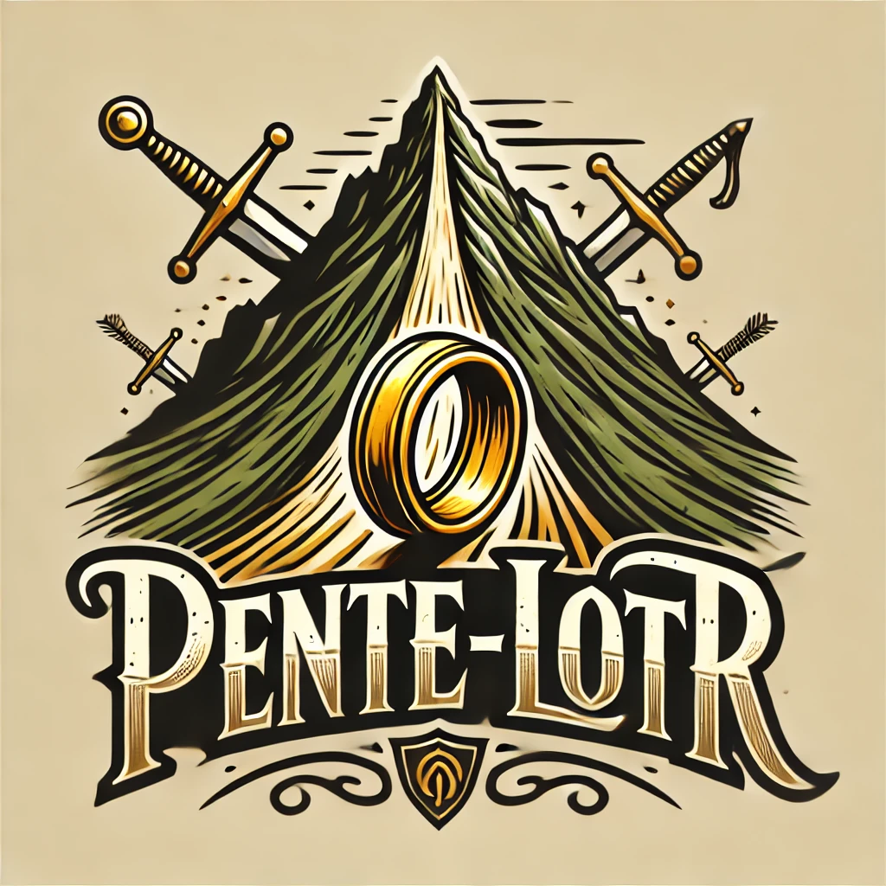
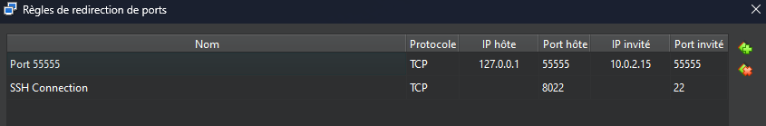

# Pente Game / LOTR

## Description

Un jeu Pente multi-joueur basé sur l'univers de "**Lord of the ring**".

Le projet Pente consiste en un jeu multijoueur où deux joueurs s'affrontent pour aligner cinq pions sur un plateau de 19x19 intersections. Le projet inclut un serveur développé en **C** et un client graphique développé en **Python** utilisant **PyGame-CE** et **PyGame-GUI**. Les données des joueurs sont stockées dans une base de données **SQLite**.

## Paramètrage

### Machine virtuelle

Veuillez allez dans les paremètres réseaux de votre VM Debian et changer la redirection de ports pour qu'ils correspondent à ceci:

### Packages

#### SERVEUR C

- CJSON : `apt install libcjson-dev`
- SQLITE3 : `apt install libsqlite3 sqlite3`

#### CLIENT PYTHON

- PYGAME-CE 2.5.2 : `pip install pygame-ce`
- PYGAME-GUI 0.6.12 : `pip install pygame-gui`

## Usage

1. Lancer la machine virtuelle.
2. Lancer le programme C. (Le message suivant doit s'indiquer "Écoute sur le port 55555").
3. Exécuter le client Python et se connecter avec un identifiant et un mot de passe. Si aucun identifiant n'est disponible, créer un compte.
4. Naviguer dans le lobby pour créer ou rejoindre une partie.
5. Jouer en tour par tour jusqu'à la victoire ou l'abandon.

## Contributeurs

- **Gandalf** : Guide suprême
- **Terry Henrard** : Développeur principal
- **Denis Moreaux** : Concepteur
- **Bilbon Sacquet** : Éclaireur
- **Pietro Sanna** : Développeur principal
- **Peregrin Toucque (Pipin)** : Compositeur

## Références

- [Documentation PyGame-CE](https://pyga.me/docs/)
- [Documentation PyGame-GUI](https://pygame-gui.readthedocs.io/en/latest/)
- [SQLite Documentation](https://www.sqlite.org/)
